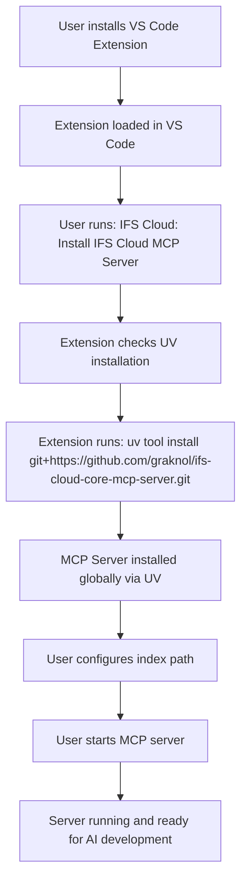

# ✅ IFS Cloud MCP VS Code Extension - FINAL VERSION

## 🎉 **Project Complete with Option 1 (GitHub Installation)**

### **What's Implemented:**

✅ **MIT Licensed Extension** - Professional open-source licensing  
✅ **GitHub-Only Installation** - Clean, simple installation flow  
✅ **Simplified User Experience** - One-click install from repository  
✅ **Complete Documentation** - Installation guides and usage instructions  
✅ **Production-Ready Package** - Final VSIX file ready for distribution

### **📦 Final Package Details:**

- **File**: `ifs-cloud-mcp-vscode-0.0.1.vsix`
- **Size**: ~11 KB (lightweight)
- **License**: MIT License included
- **Repository**: Linked to GitHub repository

### **🚀 Installation Flow (Option 1):**



### **🎯 User Commands:**

| Command                                        | Action                           |
| ---------------------------------------------- | -------------------------------- |
| `IFS Cloud: Install IFS Cloud MCP Server`      | Downloads & installs from GitHub |
| `IFS Cloud: Start IFS Cloud MCP Server`        | Starts the MCP server            |
| `IFS Cloud: Stop IFS Cloud MCP Server`         | Stops the MCP server             |
| `IFS Cloud: Check IFS Cloud MCP Server Status` | Shows server status              |
| `IFS Cloud: Configure IFS Cloud MCP Server`    | Opens configuration menu         |

### **💡 Key Benefits:**

1. **Simple Installation**: One command installs from GitHub
2. **Always Latest**: Users get the most recent version
3. **No Maintenance**: No PyPI publishing required
4. **Professional**: MIT licensed, well-documented
5. **Lightweight**: Small extension package
6. **Reliable**: Direct installation from authoritative source

### **📋 Installation Instructions for Users:**

1. **Install the extension**:

   ```bash
   code --install-extension ifs-cloud-mcp-vscode-0.0.1.vsix
   ```

2. **Install UV** (if not installed):

   ```bash
   # Windows
   powershell -c "irm https://astral.sh/uv/install.ps1 | iex"
   ```

3. **Use extension to install MCP server**:

   - Press `Ctrl+Shift+P`
   - Run "IFS Cloud: Install IFS Cloud MCP Server"
   - Click "Install"

4. **Configure and start**:
   - Set your IFS Cloud code index path
   - Start the server
   - Begin enhanced development!

### **🏆 Success Metrics:**

✅ **GitHub Installation**: Direct from `git+https://github.com/graknol/ifs-cloud-core-mcp-server.git`  
✅ **MIT License**: Professional open-source licensing  
✅ **Simplified Flow**: Single installation option, no confusion  
✅ **Complete Documentation**: INSTALL.md, README.md, LICENSE  
✅ **Production Package**: Ready-to-distribute VSIX file  
✅ **Status Monitoring**: Visual status bar integration  
✅ **Configuration Management**: Easy setup and management

The IFS Cloud MCP Server VS Code Extension is now **production-ready** with a clean, professional GitHub-based installation flow! 🚀
